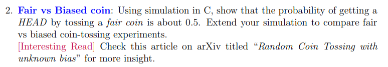
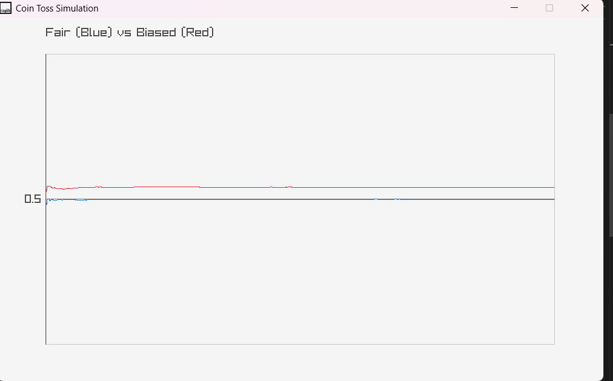

# Fair vs Biased Coin Toss Simulation

A simple C project built with **Raylib** to demonstrate the law of large numbers through coin toss simulation. The program compares the probability of getting **HEAD** using a **fair coin** and a **biased coin**, showing how the observed probability converges as the number of tosses increases.

---

## Problem Statement

Using simulation in C, show that the probability of getting a **HEAD** by tossing a **fair coin** is about **0.5**. Extend the simulation to compare **fair** and **biased** coin-tossing experiments.

### Assignment Question



---

## Output

The graph displays the running probability of obtaining **HEAD** for both coins.

- **Blue Line:** Fair Coin (Expected Probability ≈ 0.5)
- **Red Line:** Biased Coin (Expected Probability > 0.5)

As the number of tosses increases, the blue curve stabilizes near **0.5**, while the red curve converges toward the predefined bias.



---

## Features

- Simulates thousands of coin tosses
- Compares fair and biased coins simultaneously
- Real-time probability visualization
- Running probability calculation
- Color-coded graph for easy comparison
- Built using Raylib

---

## How It Works

For each toss:

1. Generate a random number.
2. Determine whether the outcome is **HEAD** or **TAIL**.
3. Update the total number of heads.
4. Compute the running probability

```text
P(HEAD) = Number of Heads / Total Tosses
```

5. Plot the probability on the graph.

The same process is repeated for both a fair coin and a biased coin.

---

## Simulation

### Fair Coin

```text
P(HEAD) = 0.5
P(TAIL) = 0.5
```

The probability fluctuates initially but gradually converges to **0.5** as the number of tosses increases.

### Biased Coin

```text
P(HEAD) = Bias
P(TAIL) = 1 − Bias
```

The biased coin converges to its predefined probability instead of 0.5.

---

## Project Structure

```text
Fair_vs_Biased_Coin/
│
├── images/
│   ├── problem_statement.png
│   └── output_graph.png
│
├── .vscode/
├── lib/
├── src/
│   └── main.cpp
│
├── .gitignore
├── .gitattributes
├── Makefile
├── README.md
└── main.code-workspace
```

---

## Building the Project

### Requirements

- C/C++ Compiler
- Raylib
- Make

Compile the project:

```bash
make
```

Run:

```bash
./Fair_vs_Biased_Coin
```

*(Executable name may differ depending on your Makefile.)*

---

## Concepts Demonstrated

- Probability
- Random Number Generation
- Monte Carlo Simulation
- Law of Large Numbers
- Running Average
- Data Visualization

---

## Expected Observation

- The **fair coin** approaches a probability of **0.5** for HEAD.
- The **biased coin** approaches its configured bias.
- Early fluctuations become smaller as the number of tosses increases.

This demonstrates that increasing the sample size produces a more accurate estimate of the true probability.

---

## Technologies Used

- C
- Raylib
- Make

---

## Future Improvements

- Allow users to change the coin bias at runtime
- Adjust the number of tosses interactively
- Display live statistics (Heads, Tails, Probability)
- Plot confidence intervals
- Compare multiple biased coins
- Export simulation results as CSV

---

## Author

**Suman Roy**

A visualization project created to understand probability, random simulations, and the convergence behavior of fair and biased coin tosses.