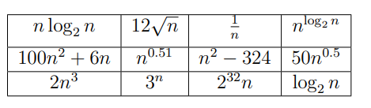
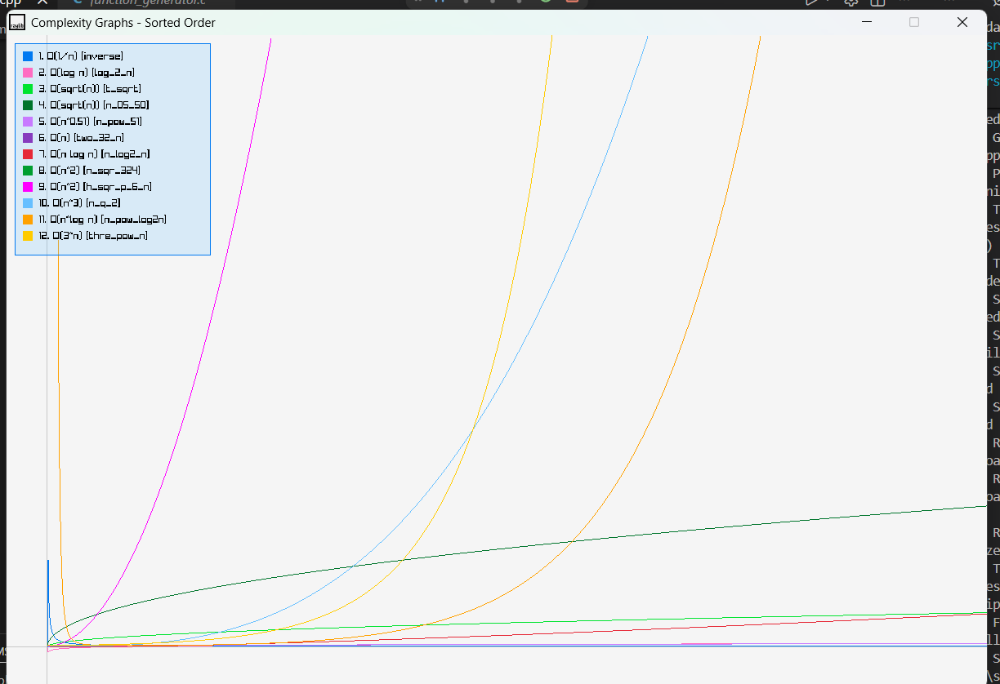

# Complexity Graph Visualizer

A simple C++ project built with **Raylib** to visualize and compare the growth rates of common time complexity functions. The project was created to help understand the "Put Them in Order" asymptotic analysis problem by plotting multiple functions on the same graph.

## Problem Statement

Arrange the following functions in **increasing order of growth** for sufficiently large values of **n**.

- 1/n
- log₂n
- √n
- n^0.5
- n log₂n
- n² − 324
- 50√n
- 100n² + 6n
- n³
- 2ⁿ
- 3ⁿ
- 2^(32n)

Instead of comparing them only mathematically, this project plots each function so their growth can be observed visually.

### Assignment Question



---

## Output

The program plots all complexity functions on a single graph, allowing you to compare their asymptotic growth visually.




## Features

- Plots multiple complexity functions on a single graph
- Different color assigned to every function
- Legend showing function names
- Interactive graph navigation
  - Zoom in/out using the mouse wheel
  - Move the graph using arrow keys
- Built with **Raylib** for fast rendering

---

## Functions Plotted

| No. | Function |
|-----|----------|
| 1 | 1 / n |
| 2 | log₂(n) |
| 3 | √n |
| 4 | 50√n |
| 5 | n^0.5 |
| 6 | 2^(32n) |
| 7 | n log₂(n) |
| 8 | n² − 324 |
| 9 | 100n² + 6n |
| 10 | n³ |
| 11 | 2ⁿ |
| 12 | 3ⁿ |

---

## Controls

| Key | Action |
|-----|--------|
| ↑ | Move graph up |
| ↓ | Move graph down |
| ← | Move graph left |
| → | Move graph right |
| Mouse Wheel | Zoom in/out |

---

## Project Structure

```
Put_them_in_order/
├── images/
│   ├── problem_statement.png
│   └── output_graph.png
├── .vscode/            # VS Code configuration
├── lib/                # Raylib and external libraries
├── src/
│   └── main.cpp        # Main source file
├── .gitattributes
├── .gitignore
├── Makefile
├── README.md
└── main.code-workspace
```

---

## Building the Project

### Requirements

- C++17 compatible compiler
- Raylib
- Make

Compile using:

```bash
make
```

Run the executable:

```bash
./Put_them_in_order
```

*(Executable name may vary depending on your Makefile.)*

---

## How It Works

Each mathematical function is implemented as a C++ function. During rendering:

1. A range of `n` values is generated.
2. Every function is evaluated for each value.
3. The result is converted into screen coordinates.
4. Raylib draws the corresponding curve using a unique color.

Since some functions (such as `3ⁿ` and `2^(32n)`) grow extremely quickly, zooming and panning are useful for exploring the graph.

---

## Learning Outcome

This project helps visualize how different functions compare as `n` becomes large. It provides an intuitive understanding of asymptotic growth instead of relying only on theoretical analysis.

The expected asymptotic ordering is:

```text
1/n
<
log₂n
<
√n = n^0.5
<
50√n
<
n log₂n
<
n² − 324
<
100n² + 6n
<
n³
<
2ⁿ
<
3ⁿ
<
2^(32n)
```

---

## Technologies Used

- C++
- Raylib
- Make

---

## Future Improvements

- Toggle functions on/off
- Display axis labels and grid
- Show coordinates under the mouse cursor
- Auto-scale the graph
- Export graph as an image
- Support user-defined functions
- Compare Big-O, Big-Θ, and Big-Ω visually

---

## Author

**Suman Roy**

Made as a small visualization project to better understand algorithm complexity and asymptotic growth.
