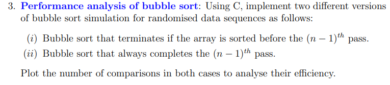
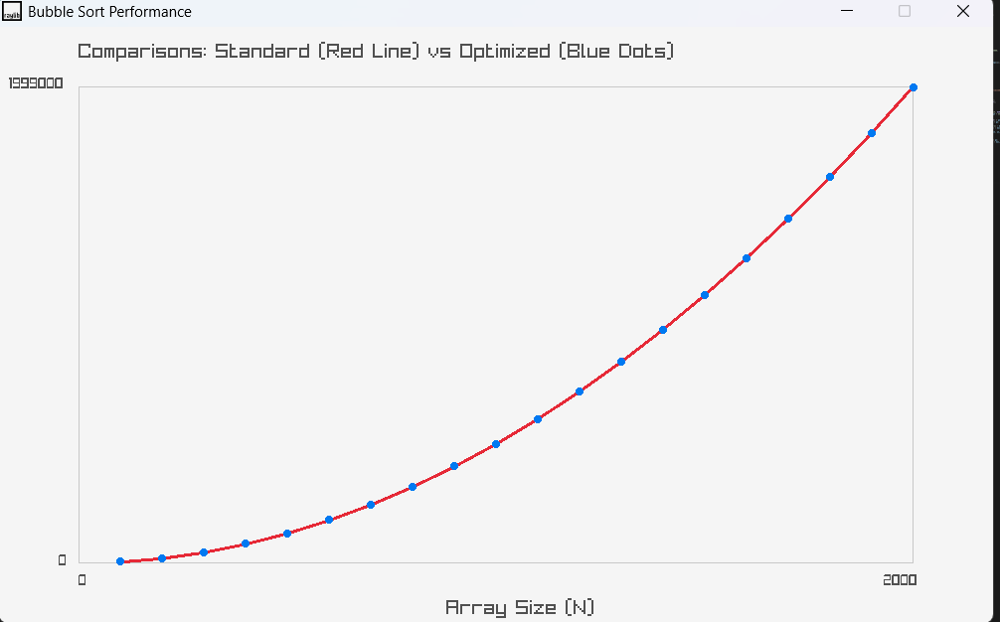

# Bubble Sort Performance Analysis

A C implementation of **Standard Bubble Sort** and **Optimized Bubble Sort** with a graphical comparison of their performance. The project measures the number of comparisons performed by both algorithms on randomized arrays and visualizes the results using **Raylib**.

---

## Problem Statement

Implement two different versions of Bubble Sort in C for randomized data sequences.

1. **Optimized Bubble Sort**
   - Terminates early if the array becomes sorted before the \((n-1)^{th}\) pass.

2. **Standard Bubble Sort**
   - Always completes all \((n-1)^{th}\) passes regardless of whether the array is already sorted.

Finally, plot the **number of comparisons** performed by both algorithms to analyze their efficiency.

### Assignment Question



---

## Output

The graph below compares the total number of comparisons performed by both Bubble Sort implementations for increasing array sizes.

- **Red Line:** Standard Bubble Sort
- **Blue Dots:** Optimized Bubble Sort



---

## Features

- Implements Standard Bubble Sort
- Implements Optimized Bubble Sort with early termination
- Counts the number of comparisons
- Tests multiple randomized array sizes
- Visualizes results using Raylib
- Easy comparison between both algorithms

---

## How It Works

For each selected array size:

1. Generate a random array.
2. Run the Standard Bubble Sort and count comparisons.
3. Run the Optimized Bubble Sort and count comparisons.
4. Store the comparison counts.
5. Plot both datasets on the same graph.

---

## Performance Analysis

The graph maps the **array size (N)** against the **total number of comparisons**.

- **Red Line:** Standard Bubble Sort
- **Blue Dots:** Optimized Bubble Sort

When tested using completely randomized arrays, both curves overlap almost perfectly.

The Standard Bubble Sort always performs

\[
\text{Comparisons}=\frac{N(N-1)}{2}
\]

Since randomized arrays rarely become sorted before the final passes, the optimized version almost never triggers its early-exit condition. Consequently, it performs nearly the same number of comparisons as the standard implementation.

As a result, both algorithms exhibit an average-case time complexity of **O(N²)**.

---

## Complexity Analysis

| Algorithm | Best Case | Average Case | Worst Case |
|-----------|-----------|--------------|------------|
| Standard Bubble Sort | O(N²) | O(N²) | O(N²) |
| Optimized Bubble Sort | O(N) | O(N²) | O(N²) |

---

## Why Do the Graphs Overlap?

The optimization only becomes effective when an entire pass completes without any swaps.

For completely randomized arrays:

- Swaps continue to occur in almost every pass.
- The early termination condition is rarely satisfied.
- Both implementations perform nearly identical numbers of comparisons.

This explains why the two curves almost perfectly overlap.

---

## When Does the Optimization Help?

The optimization provides a significant advantage when the input array is already sorted or nearly sorted.

- **Standard Bubble Sort** still executes every pass, resulting in **O(N²)** comparisons.
- **Optimized Bubble Sort** detects that no swaps occurred during the first pass and immediately terminates.

This reduces the best-case running time to **O(N)**.

---

## Conclusion

This experiment demonstrates that:

- For randomized datasets, both Bubble Sort implementations perform almost identically.
- The optimization does not improve the average-case complexity.
- The primary benefit of Optimized Bubble Sort is its excellent best-case performance on sorted or nearly sorted arrays.
- Bubble Sort remains a quadratic-time sorting algorithm and is generally unsuitable for large datasets.

---

## Project Structure

```text
Bubble_Sort_Analysis/
│
├── images/
│   ├── problem_statement.png
│   └── performance_graph.png
│
├── .vscode/
├── lib/
├── src/
│   └── main.cpp
│
├── .gitignore
├── .gitattributes
├── Makefile
├── README.md
└── main.code-workspace
```

---

## Building the Project

### Requirements

- C/C++ Compiler
- Raylib
- Make

Compile:

```bash
make
```

Run:

```bash
./Bubble_Sort_Analysis
```

*(Executable name may vary depending on your Makefile.)*

---

## Technologies Used

- C
- Raylib
- Make

---

## Future Improvements

- Compare execution time in addition to comparisons
- Support larger datasets
- Add Insertion Sort and Selection Sort for comparison
- Export graph as an image
- Allow interactive selection of array size
- Compare sorted, reverse-sorted, and nearly sorted inputs

---

## Author

**Suman Roy**

A visualization project developed to compare Standard and Optimized Bubble Sort implementations and understand their performance characteristics through graphical analysis.